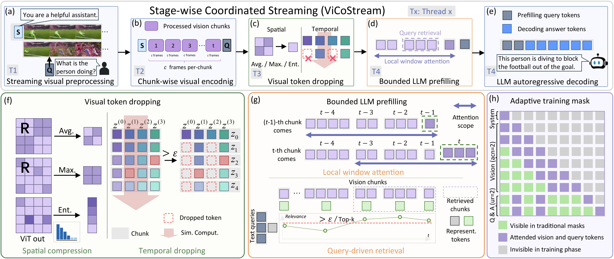
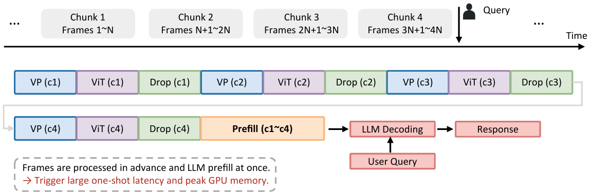
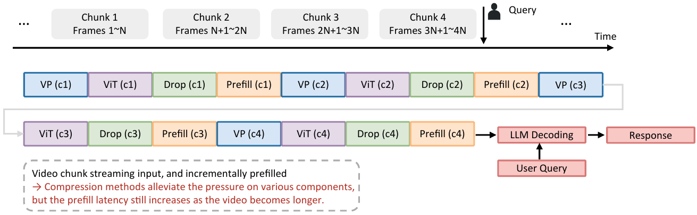
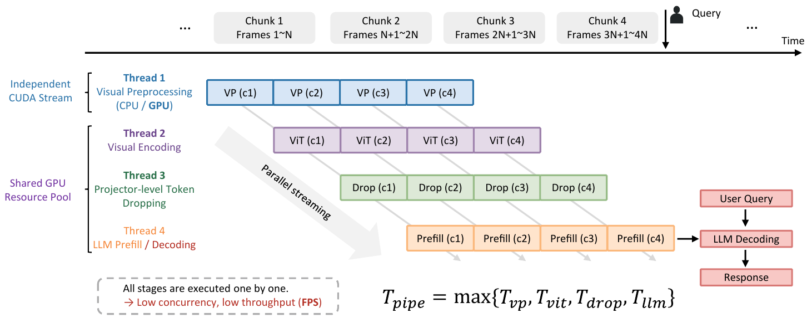

<h1 align="center"><b>ViCoStream: Streaming VideoLLMs Can Run Beyond 100 FPS with Stage-Wise Coordinated Inference</b></h1>

<p align="center">
<a href="https://arxiv.org/abs/2606.19849" target="_blank"></a>
<a href="https://github.com/EIT-NLP/StreamingLLM/tree/main/ViCoStream" target="_blank"></a>
</p>

## TL;DR

**ViCoStream is a stage-wise coordinated streaming VideoLLM framework that sustains high-throughput video ingestion while keeping query latency low.** It combines chunk-wise execution, CUDA-stream overlap, visual token control, bounded visual attention, and query-side retrieval, achieving 134 FPS video throughput and sub-50 ms TTFT on a single A100 GPU while maintaining accuracy close to full-history baselines.

## News

- **[2026.06]** ViCoStream paper is available on [arXiv](https://arxiv.org/abs/2606.19849).

## ToDo

- [ ] 

## 1. Introduction

Streaming VideoLLMs must process incoming video continuously and answer user queries at arbitrary timestamps. This creates two coupled requirements: the system must ingest video faster than it arrives, and it must answer queries with low time-to-first-token over the observed video context.

Existing acceleration methods often optimize individual modules such as visual encoding, token pruning, or KV-cache compression. ViCoStream instead treats streaming VideoLLM inference as a coordinated pipeline spanning visual preprocessing, visual encoding, token dropping, and LLM prefilling/decoding. This system-level view makes it possible to reason about bottleneck migration and the throughput--accuracy trade-off under realistic streaming constraints.

<p align="center">
  
</p>

## 2. ViCoStream Pipeline

<p align="center">
  
</p>

The pipeline contains three main components:

- **Chunk-wise prefill.** Incoming frames are grouped into chunks and prefetched incrementally, avoiding repeated processing of old frames.
- **Intra-chunk visual compression.** Redundant visual tokens inside each chunk are dropped before they enter the rolling memory.
- **Query-aware retrieval.** When a question arrives, the user query can retrieve a compact set of past visual tokens from the stream history.

Together, these stages allow ViCoStream to keep up with high-throughput video input while preserving the ability to answer timestamped questions.

## 3. Streaming Paradigms

ViCoStream is motivated by the gap between apparent streaming input and actual end-to-end streaming inference. Different serving paradigms expose different bottlenecks in query latency, memory pressure, and video-ingestion throughput.

<table>
  <tr>
    <td width="45%">
      
    </td>
    <td>
      <b>⏳ Delayed streaming.</b><br>
      Frames can be visually processed before the user query arrives, but the LLM still performs a large one-shot prefill over the accumulated video context. This reduces some front-end cost while leaving query-time latency and peak GPU memory concentrated at the moment of response.
    </td>
  </tr>
  <tr>
    <td width="45%">
      
    </td>
    <td>
      <b>🔁 Continuous streaming.</b><br>
      Each video chunk is processed and incrementally prefilled as it arrives. This is closer to real online inference, but without cross-stage coordination the prefill path can still grow with stream length and become the dominant bottleneck.
    </td>
  </tr>
  <tr>
    <td width="45%">
      
    </td>
    <td>
      <b>⚡ Stage-wise coordinated streaming.</b><br>
      ViCoStream overlaps visual preprocessing, ViT encoding, token dropping, and LLM prefill across different chunks. In steady state, throughput is governed by the slowest stage instead of the sum of all stages, enabling high-FPS ingestion with bounded query-time work.
    </td>
  </tr>
</table>

## 4. Implementation

### Evaluation

All incremental launchers are under `eval/scripts/eval_inc/`:

```bash
bash eval/scripts/eval_inc/eval_incremental_streamingbench.sh
bash eval/scripts/eval_inc/eval_incremental_ovobench.sh
bash eval/scripts/eval_inc/eval_incremental_etbench.sh
bash eval/scripts/eval_inc/eval_incremental_streambench.sh
bash eval/scripts/eval_inc/eval_incremental_vstream_ego4d.sh
bash eval/scripts/eval_inc/eval_incremental_vstream_movienet.sh
```

Before running, set the checkpoint and dataset paths in the corresponding shell script. The launchers use project-root relative paths by default. See [`eval/readme.md`](./eval/readme.md) for benchmark-specific setup.

### Training

Training follows the TimeChat-Online SFT recipe with ViCoStream's chunked prefill and token dropping patch:

```bash
bash train/finetune.sh
```

Before launching, edit `MODEL_PATH`, `OUTPUT_DIR`, and the `--dataset` entries in `train/finetune.sh`. See [`train/readme.md`](./train/readme.md) for dataset preparation and environment details.

### Installation

Please refer to the detailed setup guides:

- Training environment and dataset preparation: [`train/readme.md`](./train/readme.md)
- Evaluation environment and benchmark setup: [`eval/readme.md`](./eval/readme.md)

## Acknowledgements

ViCoStream builds on top of:

- [TimeChat-Online](https://github.com/yaolinli/TimeChat-Online), which provides the upstream online VideoLLM codebase and DTD foundation.
- [Qwen2.5-VL](https://github.com/QwenLM/Qwen2.5-VL)
- [ms-swift](https://github.com/modelscope/ms-swift)
- [StreamingBench](https://github.com/THUNLP-MT/StreamingBench)
- [OVO-Bench](https://github.com/joeleelyf/ovo-bench)

## Citation

If you find this repository useful, please cite:

```bibtex
@misc{tan2026vicostreamstreamingvideollmsrun,
      title={ViCoStream: Streaming VideoLLMs Can Run Beyond 100 FPS with Stage-Wise Coordinated Inference},
      author={Yang Tan and Junlong Tong and Linan Yue and Hao Wu and Pengfei Fang and Xiaoyu Shen},
      year={2026},
      eprint={2606.19849},
      archivePrefix={arXiv},
      primaryClass={cs.CV},
      url={https://arxiv.org/abs/2606.19849},
}
```
